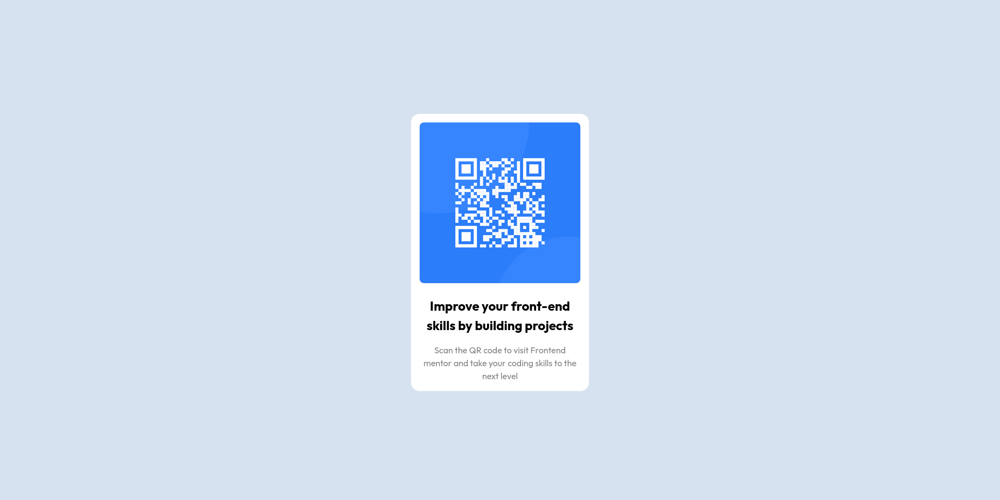

# Frontend Mentor - QR code component solution

This is a solution to the [QR code component challenge on Frontend Mentor](https://www.frontendmentor.io/challenges/qr-code-component-iux_sIO_H). 

## Overview

### Screenshot

### Links
- Live Site URL: [Here](https://clinquant-cassata-61df46.netlify.app/)

### Built with

- Basic HTML & CSS
- Used Flexbox for centering

### What I learned

This was very basic I did it in like 20min and most that time was me trying to align text using flexbox instead of just using the text-align proerty.
so I guess I learned about text-align.

### Useful resources

- [The Frontedn Mentor Challenges Page](https://www.frontendmentor.io/challenges) - This is the website I got this challenge from